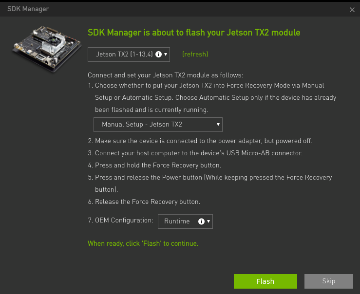
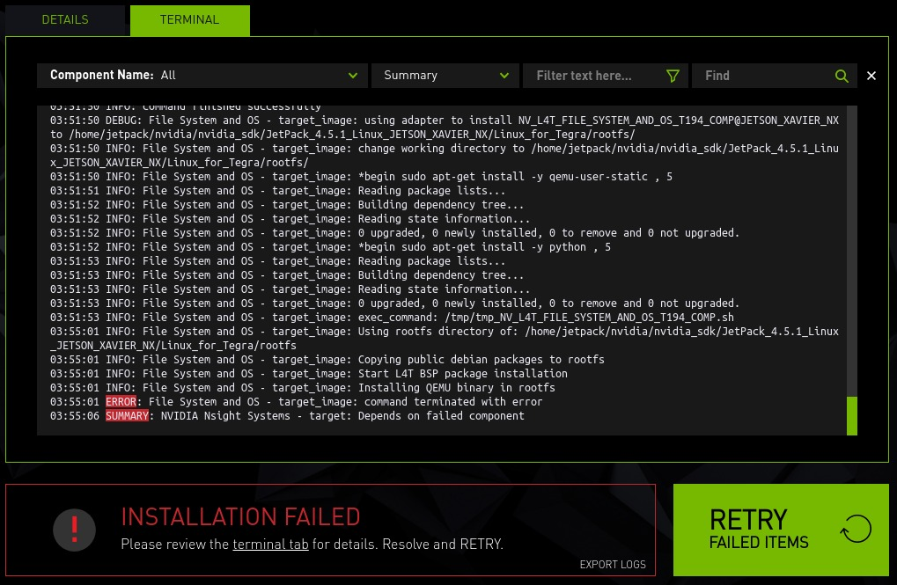

# sdk_manager_docker

## Introduction

This is a Dockerfile to use [NVIDIA SDK Manager](https://docs.nvidia.com/sdk-manager/) on Docker container.

## Important Information

NVIDIA released official Docker image(<https://docs.nvidia.com/sdk-manager/docker-containers/index.html>).

## Requirements

* Docker

## Preparation

### Download NVIDIA SDK Manager

Please download the package of NVIDIA SDK Manager from <https://developer.nvidia.com/nvidia-sdk-manager>.  
And, please put the package of NVIDIA SDK Manager in the same directory as the Dockerfile.  
This time, I used `sdkmanager_1.9.1-10844_amd64.deb`.

### Ensure your user is in the docker group

Run
```
groups
```
if docker is not one of the groups displayed you need to create the docker group and add your user to it:
```
sudo groupadd -f docker
sudo usermod -aG docker $USER
```
You should then reboot the computer to apply the changes to your user.
Afterwards you can continue with the guide.


### Build Docker image

```
docker build --build-arg GID=$(id -g) --build-arg UID=$(id -u) -t jetpack .
```

To build a Docker image with a specific SDK Manager version override the ``SDK_MANAGER_VERSION`` variable in the Docker command line

```
docker build --build-arg SDK_MANAGER_VERSION=1.8.0-10363 --build-arg GID=$(id -g) --build-arg UID=$(id -u) -t jetpack .
```

### Create Docker container

```
./launch_container.sh
```

## Launch NVIDIA SDK Manager

Please launch NVIDIA SDK Manager by the following command.

```
sdkmanager
```

Please refer to <https://docs.nvidia.com/sdk-manager/install-with-sdkm-jetson/index.html>.
And, I tested in the following setting.

* Manual Setup
* OEM Configuration: Runtime



## Notes

If you get errors like this, it means that QEMU is not installed in host/container



To configure QEMU, run below, either on host, or the running container.

```shell
./configure_qemu.sh
```
